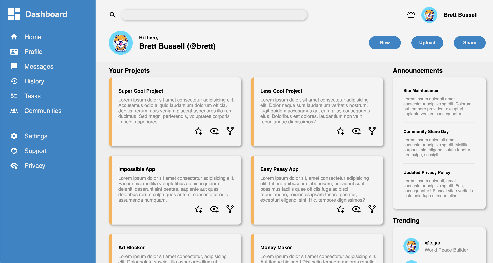

# Admin Dashboard

A simple and responsive admin dashboard interface built with HTML and CSS.

## Description

This project is a responsive admin dashboard built with HTML and CSS. It features a sidebar with navigation links, a header with search and user actions, and a main content area with a welcome message and a responsive card layout built with CSS grid. Note that this is a single page, so the interactive elements will not perform any actions.

## Screenshot



## Preview

You can view a live preview of the page [here](https://sourdoughbredd.github.io/admin-dashboard/).

## Table of Contents

- [Description](#description)
- [Screenshot](#screenshot)
- [Preview](#preview)
- [Features](#features)
- [Installation](#installation)
- [Usage](#usage)
- [Tech Stack](#tech-stack)
- [License](#license)
- [Contact Information](#contact-information)

## Features

- Responsive design
- Sidebar with navigation links
- Header with icons and search bar
- Main content area with responsive card layout

## Installation

1. Clone the repository:
   ```sh
   git clone https://github.com/sourdoughbredd/admin-dashboard.git
   ```
2. Navigate to the project directory:
   ```sh
   cd admin-dashboard
   ```
3. Open `index.html` in your preferred web browser.

## Usage

- Open `index.html` in a web browser to view the admin dashboard.

## Tech Stack

- HTML
- CSS

## License

This project is licensed under the MIT License.

## Contact Information

For any questions or suggestions, please contact Brett Bussell at [bwbussell24@gmail.com](mailto:bwbussell24@gmail.com).
